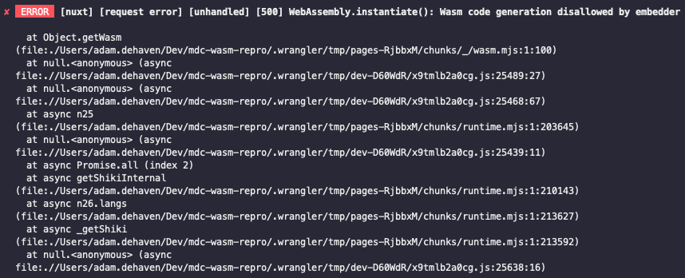

# MDC wasm repro

To reproduce the issue:

1. Clone the repo
2. Install dependencies with `pnpm install`
3. Build the project with `pnpm build`
4. Preview the app locally with wrangler: `pnpm wrangler pages dev dist`

If you open the browser, you will see the markdown document successfully renders; however, you'll notice the syntax highlighting is missing.

In your console (or in the wrangler Devtools) you'll see the following error:

